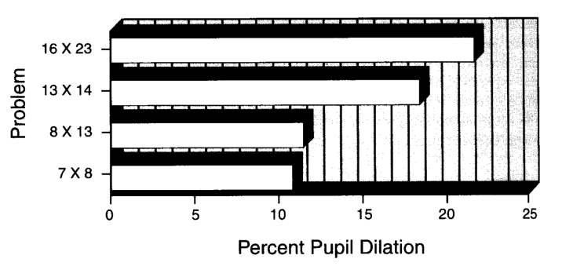

\pagebreak

# Mental arithmetic task

This experiment aimed at measuring pupil responses to mental effort exerted while multiplying numbers [@HessPolt1964;@AhernBeatty1979]. Essentially, two numbers are presented via headphones, and the participants is required to multiply them and give the answers while their pupil size is measured.

```{r, echo=FALSE, out.width = '60%', fig.cap="average \\% increase in pupil diameter as a function of problem difficulty in the mental arithmetic task. Data from Hess \\& Polt (1964), re-plotted by Ahern \\& Beatty (1979).", fig.align='center'}

```

&nbsp;

If you look at the code of the task (in the file `pupil_math.m`) you can see how the numbers were selected (around line 133):

```matlab
%% task settings
multiplicand_easy = [6,9];
multiplier_easy = [12,14];
multiplicand_hard = [11,14];
multiplier_hard = [16,19];
```

&nbsp;

For each condition, the two numbers defined the range of values that could be presented as number. Each trial then the problem randomly decided whether to run an easy or difficult trial, and sampled a single integer value (using the matlab function `randi`) for both multiplicand and multiplier. The code that do this is in the part of the code that loop over trial (around line 232 of `pupil_math.m`):

```matlab
% random
is_hard = randn(1)>0;
if is_hard
    N1 = randi(multiplicand_hard, 1);
    N2 = randi(multiplier_hard, 1);
else
    N1 = randi(multiplicand_easy, 1);
    N2 = randi(multiplier_easy, 1);
end
```

\pagebreak

# Analysis

The first steps of the analysis are the same as for the image-classification task. We begin by clearing the workspace and loading some useful custom functions (contained in the folders `functions` and `analysis_functions`). We add these to Matlab path using the function `addpath` so that we can call the functions included in these folders as if they were built-in functions.

```matlab
clear all

addpath('../functions');
addpath('./analysis_functions');
```

Next we import the edf file into Matlab using the `edfmex`. Note that for this to work you need to have installed the Eyelink API (you can find this [link](https://www.sr-research.com/support/showthread.php?tid=13) after registering to SR research forum). If you don't have the API installed, you can skip this step and load in directly the file using 

```matlab
load('S2301_edfstruct.mat')
```

(Here `S2301` is the code identifying the participant who did the task during our workshop in term 1).


We shouled end up with a similar data structure as we had last time (see handout for part 1); for example here is the `FSAMPLE` part.

```matlab
>> ds.FSAMPLE

ans = 

  struct with fields:

       time: [1×426761 uint32]
         px: [2×426761 single]
         py: [2×426761 single]
         hx: [2×426761 single]
         hy: [2×426761 single]
         pa: [2×426761 single]
         gx: [2×426761 single]
         gy: [2×426761 single]
         rx: [1×426761 single]
         ry: [1×426761 single]
      gxvel: [2×426761 single]
      gyvel: [2×426761 single]
      hxvel: [2×426761 single]
      hyvel: [2×426761 single]
      rxvel: [2×426761 single]
      ryvel: [2×426761 single]
     fgxvel: [2×426761 single]
     fgyvel: [2×426761 single]
     fhxvel: [2×426761 single]
     fhyvel: [2×426761 single]
     frxvel: [2×426761 single]
     fryvel: [2×426761 single]
      hdata: [8×426761 int16]
      flags: [1×426761 uint16]
      input: [1×426761 uint16]
    buttons: [1×426761 uint16]
      htype: [1×426761 int16]
     errors: [1×426761 uint16]
```

This data will be processed so as to transform it a format that is easier to work with (see `analysis_1_subject.m` script on github).

```matlab
>> ds2.trial

ans = 

  1×20 struct array with fields:

    trial_n
    t_start
    t_end
    t_fix
    t_N1
    t_N2
    t_resp
    N1
    N2
    response
    accuracy
    is_hard
    timestamp
    eye_x
    eye_y
    pupil_size
```

\pagebreak


## Plot of raw data

```matlab
plot(ds2.trial(1).timestamp, ds2.trial(1).pupil_size)
hold on
plot(ds2.trial(2).timestamp, ds2.trial(2).pupil_size)
plot(ds2.trial(3).timestamp, ds2.trial(3).pupil_size)
plot(ds2.trial(4).timestamp, ds2.trial(4).pupil_size)
ylim([700 , 1800])
hold off
```

```{r, echo=FALSE, out.width = '90%', fig.align='center',fig.cap="Raw pupil area data (in pixels) for 4 trials."}
knitr::include_graphics("raw_4trials.png")
```

&nbsp;

Note that in the figure even if pupil size values of 0 were removed at the previous steps (see code), we still have artifacts of pupil area decreasing very rapidly in correspondence of eye blinks. One straightforward approach for dealing with this is (yet again!) using differentiation. These apparent changes in pupil size occurring around eyeblinks are too fast to be real pupil movements; they are instead caused by the eyelid covering the pupil. Hence we compute the rate of change of pupil size as a function of time, and basically remove parts where the changes occur too fast. 

\pagebreak

This is illustrated in the next figure, where I have plotted the rate of change in pupil size as a function of time. The horizontal line represents a possible threshold for excluding artifacts.


```{r, echo=FALSE, out.width = '90%', fig.align='center',fig.cap="rate of change in raw pupil size signal for 1 trial"}
knitr::include_graphics("pupil_rate_change_1trial.png")
```

\pagebreak

## Further processing

The code below used the approach outlined above to exclude artifacts and align trials. The output will be a matrix where each row is a trial, and each column corresponds to a particular time-point.

Note that if you un-comment the lines with plotting commands you should obtain a plot similar to the previous figure. Note also that for simplicity here I just choose a threshold by eyeballing the raw data - one could select one automatically for example by adjusting the values until it exclude at most only a few % (e.g. 1%) or so of the data.

```matlab
% create a matrix where to align data from all trials
pa_matrix = NaN(length(ds2.trial), max([ds2.trial(1:4).timestamp]));

for i = 1:length(ds2.trial)

    time = ds2.trial(i).timestamp;
    pa = ds2.trial(i).pupil_size;
    t_0 = ds2.trial(i).t_N1;
    t_1 = ds2.trial(i).t_resp;
    
    % compute rate of change in pupil size
    pavel = vecvel(pa', 1000, 2);  
    
    %     Make a plot of rate of change for a single trial
    %     plot(time, abs(pavel)); hold on
    %     plot([-4000, 12000],[0.4,0.4]*10^4); hold off
    
    % by eyeballing the plots above, I choose 0.4*10^4 as a threshold, and
    % I change to Nan all values that exceed it
    pa(abs(pavel) > 0.4*10^4) = NaN;
    pa(pa<650) = NaN;
    
    % compute average pupil dilation for baseline (before first number, 
    % corresponding to negative time stamps)
    baseline = nanmean(pa(time<0));
    
    % select only the same interval for each trial, starting with
    % presentation of first number
    pa_ok = pa(time>=0 & time<(t_1 - t_0));
    
    % normalize by computing proportion change with respect to baseline
    pa_ok = ((pa_ok / baseline)-1).*100;
    
    % save current trials in the matrix
    pa_matrix(i, 1:size(pa_ok,2)) = pa_ok ;
    
end

```

Note that to normalize the pupil size I used this transformation:

$$\text{pupil change} = \left( \frac{\text{pupil}}{\text{baseline}}-1 \right) \times 100$$

\pagebreak

Having done that, we can make a nicer plot showing all individual-trials traces (in gray) and the grand average (in black).

```matlab
% compute the averave
pa_mean = nanmean(pa_matrix);

% transform time in seconds
time_sec = (1:length(pa_mean))/1000;

% make plot
set(gcf,'color','w');
hold on
line(time_sec, pa_matrix,'LineWidth',0.2,'LineStyle','-','color',[0.8 0.8 0.8])

% line indicating 2nd number presentation
line([2,2],[-40,85],'LineWidth',0.2,'LineStyle','--','color',[0.5 0.5 0.5]);

plot(time_sec, pa_mean,'k','LineWidth',2,'LineStyle','-')
hold off
ylim([min(pa_matrix(:)), max(pa_matrix(:))])
xlim([-0.5, 10])
xlabel('Time [sec]');
ylabel('Pupil area [% change from baseline]');
```

```{r, echo=FALSE, out.width = '90%', fig.align='center'}
knitr::include_graphics("raw_average.png")
```

\pagebreak

## Final plot

An even better plot can be obtained by smoothing the grand average and showing it's standard error instead of individual trials.

```matlab
% Calculating the standard error of the mean (SEM)
pa_std = nanstd(pa_matrix); % Standard deviation of pa_matrix, ignoring NaNs
n = sum(~isnan(pa_matrix)); % Count non-NaN entries for each time point
sem = pa_std ./ sqrt(n); % SEM calculation

% Mean and SEM calculations for plotting
pa_mean = nanmean(pa_matrix); % Mean of pa_matrix, ignoring NaNs
pa_mean_smooth = movmean(pa_mean,300); % Moving average of pa_mean for smoothing

% Time vector for plotting
time_sec = (1:length(pa_mean_smooth))/1000;

% Plotting
set(gcf,'color','w');
hold on

% line indicating 2nd number presentation
line([2,2],[-40,85],'LineWidth',0.2,'LineStyle','--','color',[0.5 0.5 0.5]);

% Adding the ribbon for SEM
fill([time_sec, fliplr(time_sec)], [pa_mean_smooth+sem, fliplr(pa_mean_smooth-sem)], ...
    [0.9 0.9 0.9], 'linestyle', 'none');

% Re-plotting the mean line so it's on top of the ribbon
plot(time_sec, pa_mean_smooth, 'k', 'LineWidth', 2);
ylim([-20, 40])
xlim([-0.5, 10])
xlabel('Time [sec]');
ylabel('Pupil area [% change from baseline]');
hold off
```


```{r, echo=FALSE, out.width = '90%', fig.align='center', fig.cap='Final plot. How does the peaj pupil dilation compare to the results from Hess and Polt shown in the first figure?'}
knitr::include_graphics("mean_pupil_ribbon.png")
```


&nbsp;


\pagebreak


# Exercises:

- [ ] Try an visualize the rate of change of pupil size for different trials, and examine how the results change when using different threshold values. Can you find a better value than `0.4*10^4` ?

- [ ] Repeat the analysis by splitting easy and hard problems, and see if there is larger dilation for harder problems. To do so, note that the `ds2.trial` structure has a `is_hard` field that indicate whether the trial was hard (`is_hard`=1) or easy (`is_hard`=0).


\pagebreak

# References